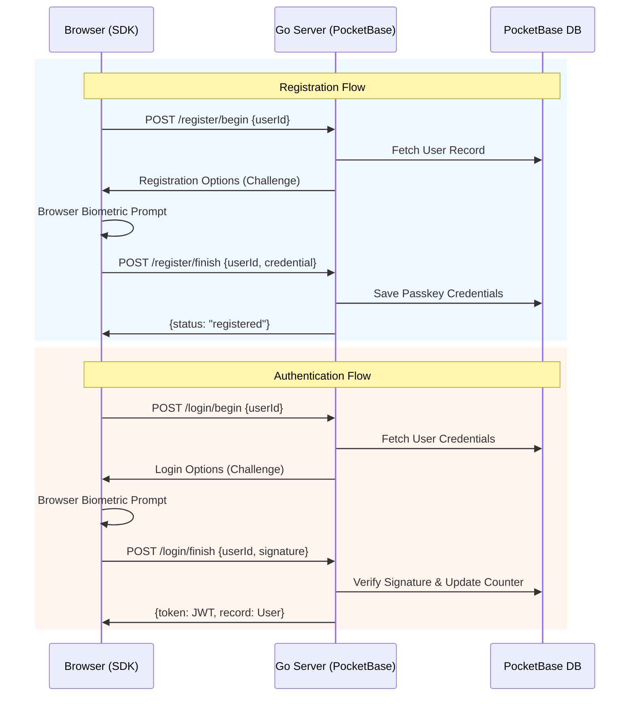

# 🔐 PocketBase Passkey (WebAuthn)

[](https://opensource.org/licenses/MIT)
[](https://www.npmjs.com/package/pocketbase-passkey)
[](./docker-compose.yml)

A professional, drop-in solution for integrating **Passkey (WebAuthn)** authentication into **PocketBase**. This project provides a secure Go-based backend implementation and a developer-friendly TypeScript SDK for modern biometric login (Face ID, Touch ID, Windows Hello).

## 🏗️ Architecture

The flow involves a seamless interaction between your web application, the Passkey Go server (extending PocketBase), and the browser's native WebAuthn API.



## 🚀 Features

- **✅ One-Click Auth**: High-level SDK methods `register()` and `login()` handle the entire WebAuthn complexity.
- **🔒 Production Hardened**: Support for `RPID` environment variables, session challenge TTL (5min), and body-based user identification.
- **📦 PocketBase Integration**: Automatically stays in sync with the official PocketBase JavaScript SDK's `authStore`.
- **🐳 Dockerized**: Single-command deployment using Docker Compose.

## 🛠️ Prerequisites

- **Go**: 1.22+
- **Node.js**: 18+
- **PocketBase**: Latest version (handled via included server source)

## 🏁 Quick Start

```bash
git clone https://github.com/your-username/pocketbase-passkey.git
cd pocketbase-passkey
docker-compose up -d
```

> [!TIP]
> Once running, the **Interactive Demo** is immediately available at **`http://localhost:8090`**.

### 2. Manual Setup

```bash
cd server
go build -o pocketbase-passkey main.go passkey.go
./pocketbase-passkey serve
```

The Go server automatically serves the frontend from the `server/pb_public` directory on port `8090`.

**SDK (NPM)**

```bash
npm install pocketbase-passkey
```

| `PASSKEY_RP_ORIGINS` | Allowed origins (comma-separated) | `http://localhost:8090` |

## 🚢 Production Deployment

### 1. The Docker Way (Recommended)

The project is built for **Docker**. Simply push your repository and run:

```bash
docker-compose up -d --build
```

### 2. Required Environment Variables

Ensure these are set in your production environment (e.g., in `docker-compose.yml` or your CI/CD):

- `PASSKEY_RPID`: Your domain (e.g. `auth.example.com`).
- `PASSKEY_RP_ORIGINS`: Your full app URL (e.g. `https://auth.example.com`).

### 3. HTTPS & Reverse Proxy

**WebAuthn requires HTTPS.** We recommend using **Caddy** as it handles SSL automatically:

```caddyfile
auth.example.com {
    reverse_proxy localhost:8090
}
```

### 4. PocketBase Setup

1. Access the Admin UI at `https://your-domain/_/`.
2. Create your initial admin account.
3. Ensure the `users` collection has a `passkey_credentials` field (JSON type).

## 🛠️ Maintenance

### Automated Updates

This project is configured with **GitHub Dependabot**. It will automatically check for security updates and new releases of **PocketBase** and other dependencies every week, opening a Pull Request for your review.

### Manual Updates

To manually update the PocketBase core to the latest version:

```bash
cd server
go get -u github.com/pocketbase/pocketbase@latest
go mod tidy
go build -o pocketbase-passkey main.go passkey.go
```

## 📜 License

This project is licensed under the MIT License - see the [LICENSE](LICENSE) file for details.
